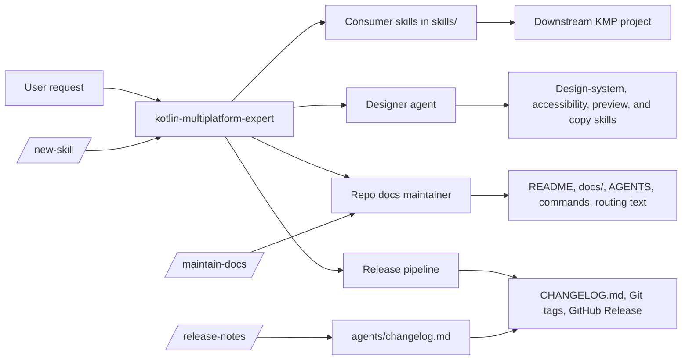
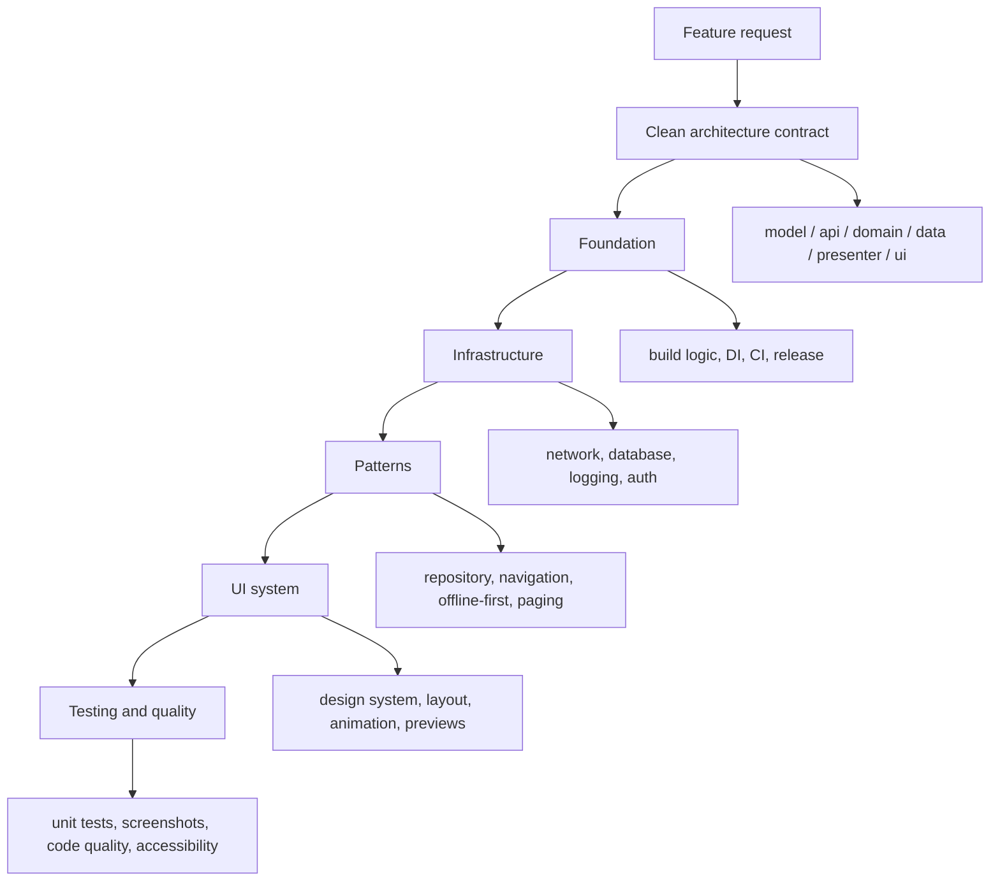
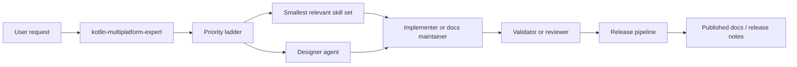

# kmm-agent-skills

[](https://skills.sh/ronjunevaldoz/kmm-agent-skills)
[](LICENSE)
[](https://github.com/ronjunevaldoz/kmm-agent-skills)
[](https://github.com/ronjunevaldoz/kmm-agent-skills)

AI agent skills for **Kotlin Multiplatform (KMP)** development.

The goal is simple: keep KMP work clean, repeatable, and easy to audit. These skills
favor clear module boundaries, version catalogs, build-logic convention plugins, and
explicit review loops before code is generated.

Read [GETTING_STARTED.md](GETTING_STARTED.md) for the quick overview, then use
`kotlin-multiplatform-expert` first. It routes you to the smallest relevant skill set.

**Start here:** read [GETTING_STARTED.md](GETTING_STARTED.md), then ask
`kotlin-multiplatform-expert` what to use next.

---

## Quick Start

1. Start with `kotlin-multiplatform-expert`.
2. Use `kotlin-multiplatform-feature-scaffold` for new projects from `Kotlin/kmp-wizard` `all-targets`.
3. Add the domain skills below only when the task needs them.

## Priority Guide

Treat the skill map as a ladder, not a checklist:

1. Start with `kotlin-multiplatform-expert`.
2. Load the smallest set that answers the request.
3. Prefer contract and foundation skills before domain, UI, testing, docs, or release skills.
4. If two skills overlap, pick the one earlier in the dependency graph.

## Skill Map

### Repo Architecture



Consumer skills are the installable surface downstream projects use. Repo docs,
agents, commands, and scripts maintain this repository's own workflow and release
surface. The designer agent keeps KMM and Compose component decisions aligned before
implementation starts.

Before routing any docs task, classify it as repo-internal or downstream consumer.
Repo docs stay with `docs-maintainer`; downstream project docs go to
`project-docs-maintainer`.

Update this diagram whenever a skill, agent, command, or routing rule changes. Keep
it aligned with `skills/kotlin-multiplatform-expert/SKILL.md`, `agents/*.md`, and the
public command docs.

---

### KMM Architecture



This is the downstream project shape the skills support. Use the earliest relevant
layer, then add lower layers only when the feature truly needs them.

---

### Consumer Routing Architecture



Consumer routing starts with the expert. Route to the earliest tier that answers the
request, then expand only when the next layer is needed. For UI/UX or component work,
the designer agent runs before implementation so the design system and Compose patterns
stay consistent.

---

### Foundation

- [`kotlin-multiplatform-feature-scaffold`](skills/kotlin-multiplatform-feature-scaffold/) - 6-layer module structure, build-logic, TOML catalog, Koin
- [`kotlin-multiplatform-clean-architecture`](skills/kotlin-multiplatform-clean-architecture/) - layer contract, `:model` vs `:api`, `internal` rules, Detekt enforcement
- [`kotlin-multiplatform-presenter-module`](skills/kotlin-multiplatform-presenter-module/) - pure-Kotlin ViewModel, MVI contracts, no Compose dep, Koin wiring
- [`kotlin-multiplatform-dependency-injection`](skills/kotlin-multiplatform-dependency-injection/) - Koin wiring and scopes
- [`kotlin-multiplatform-flavor-environment`](skills/kotlin-multiplatform-flavor-environment/) - BuildKonfig, secrets, env setup
- [`kotlin-multiplatform-ci-github-actions`](skills/kotlin-multiplatform-ci-github-actions/) - CI matrix and release workflow

### Infrastructure

- [`kotlin-multiplatform-ktor-auth-service`](skills/kotlin-multiplatform-ktor-auth-service/) - auth service, bearer/JWT, sessions, RPC
- [`kotlin-multiplatform-mongodb-database`](skills/kotlin-multiplatform-mongodb-database/) - MongoDB coroutine driver and repositories
- [`kotlin-multiplatform-kotlin-rpc`](skills/kotlin-multiplatform-kotlin-rpc/) - Kotlin RPC boundaries and scaffolding
- [`kotlin-multiplatform-network-layer`](skills/kotlin-multiplatform-network-layer/) - Ktor client, auth refresh, result mapping
- [`kotlin-multiplatform-sqldelight-setup`](skills/kotlin-multiplatform-sqldelight-setup/) - SQLDelight schema, drivers, migrations
- [`kotlin-multiplatform-datastore`](skills/kotlin-multiplatform-datastore/) - Preferences DataStore + Proto DataStore, expect/actual factory, Koin wiring, SharedPreferences migration
- [`kotlin-multiplatform-xcframework-spm`](skills/kotlin-multiplatform-xcframework-spm/) - XCFramework and SPM export
- [`kotlin-multiplatform-jni-pro`](skills/kotlin-multiplatform-jni-pro/) - JVM JNI bridge to native C/C++ libraries, wrapper/C-shim discipline, memory-safe interop

### Patterns

- [`kotlin-multiplatform-expect-actual`](skills/kotlin-multiplatform-expect-actual/) - platform differences
- [`kotlin-multiplatform-repository-pattern`](skills/kotlin-multiplatform-repository-pattern/) - repository boundary and fetch strategy
- [`kotlin-multiplatform-navigation`](skills/kotlin-multiplatform-navigation/) - type-safe navigation
- [`kotlin-multiplatform-deep-linking`](skills/kotlin-multiplatform-deep-linking/) - App Links, Universal Links, NavHost deep-link routing
- [`kotlin-multiplatform-shared-resources`](skills/kotlin-multiplatform-shared-resources/) - shared resources and localization
- [`kotlin-multiplatform-mvi`](skills/kotlin-multiplatform-mvi/) - State / Intent / Effect flow
- [`kotlin-multiplatform-logging`](skills/kotlin-multiplatform-logging/) - logger wrapper, kotlin-logging or Kermit, crash boundary, Koin wiring
- [`kotlin-multiplatform-crash-reporting`](skills/kotlin-multiplatform-crash-reporting/) - Firebase Crashlytics + Sentry, CrashReporter interface, dSYM symbolication
- [`kotlin-multiplatform-offline-first`](skills/kotlin-multiplatform-offline-first/) - SyncState, SyncManager, optimistic updates, conflict resolution
- [`kotlin-multiplatform-paging`](skills/kotlin-multiplatform-paging/) - Paging 3, PagingSource, RemoteMediator, load-state handling
- [`kotlin-multiplatform-image-loading`](skills/kotlin-multiplatform-image-loading/) - Coil 3, AsyncImage, single ImageLoader, cache
- [`kotlin-multiplatform-permissions`](skills/kotlin-multiplatform-permissions/) - PermissionState, expect/actual PermissionController, Android + iOS
- [`kotlin-multiplatform-push-notifications`](skills/kotlin-multiplatform-push-notifications/) - FCM + APNs, PushToken, NotificationHandler expect/actual
- [`kotlin-multiplatform-workmanager`](skills/kotlin-multiplatform-workmanager/) - CoroutineWorker, BGTaskScheduler, expect/actual BackgroundScheduler
- [`kotlin-multiplatform-analytics`](skills/kotlin-multiplatform-analytics/) - sealed AnalyticsEvent, Firebase/Amplitude, screen tracking, FakeAnalytics
- [`kotlin-multiplatform-feature-flags`](skills/kotlin-multiplatform-feature-flags/) - FeatureFlag enum, Firebase Remote Config, A/B variants, kill switch
- [`kotlin-multiplatform-form-validation`](skills/kotlin-multiplatform-form-validation/) - ValidationResult, FieldState, synchronous + async validators, submit gating
- [`kotlin-multiplatform-biometric-auth`](skills/kotlin-multiplatform-biometric-auth/) - BiometricResult, expect/actual BiometricAuthenticator, BiometricPrompt

### UI System

- [`kotlin-multiplatform-design-system`](skills/kotlin-multiplatform-design-system/) - tokens and core components
- [`kotlin-multiplatform-design-system-extended`](skills/kotlin-multiplatform-design-system-extended/) - extended component set
- [`kotlin-multiplatform-adaptive-layout`](skills/kotlin-multiplatform-adaptive-layout/) - WindowSizeClass, Compact/Medium/Expanded breakpoints, list-detail split
- [`kotlin-multiplatform-compose-animation`](skills/kotlin-multiplatform-compose-animation/) - AnimatedVisibility, Crossfade, AnimatedContent, shared elements
- [`kotlin-multiplatform-compose-slot-api`](skills/kotlin-multiplatform-compose-slot-api/) - slot-based component APIs
- [`kotlin-multiplatform-compose-state-hoisting`](skills/kotlin-multiplatform-compose-state-hoisting/) - hoisting rules
- [`kotlin-multiplatform-compose-state-container`](skills/kotlin-multiplatform-compose-state-container/) - `remember` vs `ViewModel`
- [`kotlin-multiplatform-graphics-modifiers`](skills/kotlin-multiplatform-graphics-modifiers/) - canvas and graph surfaces
- [`kotlin-multiplatform-preview-driven-development`](skills/kotlin-multiplatform-preview-driven-development/) - Desktop-first `@Preview` workflow, `PreviewParameterProvider`, PDD cycle

### Testing & Quality

- [`kotlin-multiplatform-unit-testing`](skills/kotlin-multiplatform-unit-testing/) - `runTest`, Turbine, fake-over-mock, `:core:testing` fixtures
- [`kotlin-multiplatform-roborazzi`](skills/kotlin-multiplatform-roborazzi/) - screenshot tests from `@Preview` on JVM, golden images, CI diff
- [`kotlin-multiplatform-code-quality`](skills/kotlin-multiplatform-code-quality/) - Ktlint (formatting) + Detekt (architecture rules), CI gates
- [`kotlin-multiplatform-accessibility`](skills/kotlin-multiplatform-accessibility/) - semantic roles, contentDescription, touch targets, Roborazzi a11y snapshots

### Meta

- [`kotlin-multiplatform-expert`](skills/kotlin-multiplatform-expert/) - skill routing and build order
- [`kotlin-multiplatform-project-docs-maintainer`](skills/kotlin-multiplatform-project-docs-maintainer/) - consumer-facing project docs, onboarding, and docs/reference sync
- [`kotlin-multiplatform-audit`](skills/kotlin-multiplatform-audit/) - repo review, fix sequencing, and CI governance gate
- [`kotlin-multiplatform-layout-system`](skills/kotlin-multiplatform-layout-system/) - ASCII wireframe docs for screens in `docs/layout-system/`; draft and document app layout
- [`kotlin-multiplatform-lessons`](skills/kotlin-multiplatform-lessons/) - structured lesson files capturing pattern mismatches and fixes
- [`kotlin-multiplatform-skill-harvester`](skills/kotlin-multiplatform-skill-harvester/) - reads lesson files and proposes amendments to source skills
- [`kotlin-multiplatform-release`](skills/kotlin-multiplatform-release/) - versioning, Maven Central publishing, pre-release suffixes, git-cliff changelog, GitHub Release
- [`kotlin-multiplatform-legal-docs`](skills/kotlin-multiplatform-legal-docs/) - privacy policy, terms, data-safety labels, consent gates, and legal compliance screens

---

## Agent Pipeline

Seven specialized agents orchestrate end-to-end feature work and repo docs. Agents
communicate via a structured plan contract and read `.claude/pipeline-context.json` to
avoid repeating past mistakes.

| Agent | Role |
|---|---|
| [`planner`](agents/planner.md) | Analyzes the task, loads only relevant skills, produces a layer-by-layer plan, gates on user approval |
| [`designer`](agents/designer.md) | Shapes KMM/Compose wireframes, diagrams, layouts, component APIs, accessibility, previews, and copy before implementation |
| [`implementer`](agents/implementer.md) | Executes the approved plan in 6-layer build order, generates complete runnable code |
| [`reviewer`](agents/reviewer.md) | Checks layer boundaries, Koin wiring, MVI contracts, and test coverage; runs `audit_project.py` |
| [`docs-maintainer`](agents/docs-maintainer.md) | Keeps README, `docs/` reference material, agent docs, command docs, and skill routing text aligned with the repo |
| [`validator`](agents/validator.md) | Runs Gradle compilation and `jvmTest` in escalating levels; stops at first failure |
| [`fixer`](agents/fixer.md) | Applies minimum targeted fixes for reviewer/validator blockers; rates confidence; asks user for LOW-confidence calls |

The `changelog` agent is separate and handles consumer release notes plus per-skill
`## Changelog` updates.

Consumer repos should keep docs organization, `CHANGELOG.md`, and release notes aligned
with the release flow; this repo enforces that through the changelog agent and release
validation.

---

## Slash Commands

Use these in Claude Code to run the full pipeline with a single command.

| Command | What it does |
|---|---|
| `/execute-ticket <id>` | Fetch a GitHub Issue (or paste any ticket), plan → branch → implement → validate → review → commit |
| `/implement-feature <name>` | Plan → Implement → Validate → Review a new KMP feature end-to-end |
| `/review-changes` | Review current git diff against 6-layer rules and skill anti-patterns |
| `/maintain-docs [scope]` | Reconcile repo docs, agent docs, command docs, and skill routing text |
| `/run-audit [path]` | Run `audit_project.py` with per-finding remediation from the relevant skill |

---

## Hooks

Shell scripts for enforcing architecture hygiene locally and in CI.

| Hook | Trigger | What it does |
|---|---|---|
| [`pre-commit-audit.sh`](hooks/pre-commit-audit.sh) | Before `git commit` | Blocks commit if staged `.kt` files have architecture findings |
| [`validate-architecture.sh`](hooks/validate-architecture.sh) | Claude Code `PostToolUse` | Runs audit after any file edit |
| [`check-skill-freshness.sh`](hooks/check-skill-freshness.sh) | Manual / CI schedule | Warns if any skill's `last-updated` is > 90 days old |

**Install all hooks (one command):**
```bash
bash scripts/install-hooks.sh
```

Or manually:
```bash
ln -sf ../../hooks/pre-commit-audit.sh .git/hooks/pre-commit
```

---

## Governance (for skill consumers)

Enforce skill compliance automatically in your CI.

**1. Add `.kmm-skills` to your project root:**

```json
{
  "skills_repo": "ronjunevaldoz/kmm-agent-skills",
  "version": "1.25.0"
}
```

Pin a release tag in `version` rather than `main` or another mutable ref. The
governance check fails if the pin is missing or not tag-shaped.

**2. Add a governance workflow:**

```yaml
# .github/workflows/governance.yml
name: KMM Governance
on: [pull_request, push]

jobs:
  kmm-governance:
    uses: ronjunevaldoz/kmm-agent-skills/.github/workflows/kmm-audit.yml@main
    with:
      project_root: .
      fail_on: HIGH          # or MEDIUM for stricter enforcement
      skills_ref: v1.25.0   # pin to a tag for reproducibility
```

That is the complete setup. The reusable workflow checks out this repo and runs
`governance_check.py`.

| `fail_on` | What it catches |
|---|---|
| `HIGH` (default) | Architecture boundary violations, hardcoded colors, Material theme usage |
| `MEDIUM` | Also catches hardcoded dp literals and layout pattern inconsistency |
| `LOW` | Full enforcement — any finding fails the build |

<a name="when-to-file-here"></a>
**When to file an issue here vs. in your own project:**
File here only if the skill guidance itself is wrong or incomplete. If you applied the guidance correctly and your project still broke, file the issue in your own repo. Use `/report-skill-issue` from any Claude session to file skill issues with the correct template.

---

## Trigger Keywords

Phrases that activate each skill automatically.

| Skill | Say something like… |
|---|---|
| [`expert`](skills/kotlin-multiplatform-expert/) | "where do I start KMP", "which skill should I use", "KMP architecture decision" |
| [`project-docs-maintainer`](skills/kotlin-multiplatform-project-docs-maintainer/) | "project docs", "consumer docs", "README", "getting started", "docs reference", "architecture diagram", "library docs", "app docs" |
| [`feature-scaffold`](skills/kotlin-multiplatform-feature-scaffold/) | "new KMP feature", "add a screen", "scaffold feature module", "create module" |
| [`clean-architecture`](skills/kotlin-multiplatform-clean-architecture/) | "6-layer architecture", "which layer does this go in", "layer contract", "domain isolation" |
| [`presenter-module`](skills/kotlin-multiplatform-presenter-module/) | "KMP ViewModel", "presenter layer", "pure Kotlin ViewModel", "StateFlow ViewModel" |
| [`dependency-injection`](skills/kotlin-multiplatform-dependency-injection/) | "Koin setup", "inject dependency", "wire dependencies", "Hilt alternative" |
| [`flavor-environment`](skills/kotlin-multiplatform-flavor-environment/) | "staging URL", "API endpoint config", "dev/staging/prod", "environment variable" |
| [`ci-github-actions`](skills/kotlin-multiplatform-ci-github-actions/) | "set up CI", "GitHub Actions", "continuous integration", "automate build" |
| [`ktor-auth-service`](skills/kotlin-multiplatform-ktor-auth-service/) | "sign in", "JWT auth", "bearer token", "refresh token", "OAuth" |
| [`mongodb-database`](skills/kotlin-multiplatform-mongodb-database/) | "MongoDB", "server-side database", "document collection" |
| [`kotlin-rpc`](skills/kotlin-multiplatform-kotlin-rpc/) | "Kotlin RPC", "shared API contract", "client/server contract" |
| [`network-layer`](skills/kotlin-multiplatform-network-layer/) | "API call", "HTTP request", "REST API", "Ktor client", "safeRequest" |
| [`sqldelight-setup`](skills/kotlin-multiplatform-sqldelight-setup/) | "local database KMP", "Room alternative", "SQLite KMP", "offline storage" |
| [`datastore`](skills/kotlin-multiplatform-datastore/) | "save user settings", "local storage KMP", "Preferences DataStore", "app settings" |
| [`xcframework-spm`](skills/kotlin-multiplatform-xcframework-spm/) | "XCFramework", "Swift Package Manager", "iOS distribution", "Package.swift" |
| [`expect-actual`](skills/kotlin-multiplatform-expect-actual/) | "iOS only code", "platform-specific implementation", "expect fun", "actual class" |
| [`repository-pattern`](skills/kotlin-multiplatform-repository-pattern/) | "offline-first", "cache-first", "single source of truth", "data layer strategy" |
| [`navigation`](skills/kotlin-multiplatform-navigation/) | "navigate to screen", "nav graph", "pass arguments", "back stack", "web routing", "browser fragment" |
| [`shared-resources`](skills/kotlin-multiplatform-shared-resources/) | "i18n", "translations", "app strings KMP", "localize", "compose resources" |
| [`mvi`](skills/kotlin-multiplatform-mvi/) | "MVI pattern", "navigation effect", "one-shot event", "UiState / UiIntent / UiEffect" |
| [`logging`](skills/kotlin-multiplatform-logging/) | "logger wrapper", "logger facade", "kotlin-logging", "Kermit", "KMP logging", "crash reporting", "log levels" |
| [`design-system`](skills/kotlin-multiplatform-design-system/) | "AppTheme", "design tokens", "Material3 alternative", "custom typography" |
| [`design-system-extended`](skills/kotlin-multiplatform-design-system-extended/) | "bottom sheet", "dialog", "snackbar", "skeleton", "extended components" |
| [`compose-slot-api`](skills/kotlin-multiplatform-compose-slot-api/) | "slot API", "content lambda", "composable slot", "flexible component" |
| [`compose-state-hoisting`](skills/kotlin-multiplatform-compose-state-hoisting/) | "state hoisting", "lift state", "stateless composable", "where does state go" |
| [`compose-state-container`](skills/kotlin-multiplatform-compose-state-container/) | "remember vs ViewModel", "state survival", "config change", "process death" |
| [`graphics-modifiers`](skills/kotlin-multiplatform-graphics-modifiers/) | "custom drawing", "Canvas", "graphicsLayer", "workflow node", "node editor" |
| [`preview-driven-development`](skills/kotlin-multiplatform-preview-driven-development/) | "PDD", "@Preview", "desktop preview", "PreviewParameterProvider", "fast UI iteration" |
| [`unit-testing`](skills/kotlin-multiplatform-unit-testing/) | "unit test", "runTest", "Turbine", "test ViewModel", "fake repository" |
| [`roborazzi`](skills/kotlin-multiplatform-roborazzi/) | "screenshot test", "visual regression", "test layout", "canvas test", "100% accuracy" |
| [`code-quality`](skills/kotlin-multiplatform-code-quality/) | "Ktlint", "Detekt", "code style", "static analysis", "layer violation" |
| [`audit`](skills/kotlin-multiplatform-audit/) | "audit repo", "project health", "what is wrong with this project", "architecture drift", "governance check", "CI enforcement" |
| [`release`](skills/kotlin-multiplatform-release/) | "publish to Maven Central", "release project", "cut release", "release library", "bump version", "git-cliff", "alpha release", "GitHub Release" |

---

## Targets

- Android - `androidTarget()` - `:androidApp`
- iOS - `iosArm64()`, `iosSimulatorArm64()` - `:iosApp`
- Desktop - `jvm()` - `:desktopApp`
- Web - `js { browser() }`, `wasmJs { browser() }` - `:webApp`

---

## Installation

See **[RELEASING.md](RELEASING.md)** for the release process (used by both humans and agents).

See **[INSTALL.md](INSTALL.md)** for full setup instructions for every assistant:
Claude Code, OpenAI Codex CLI, GitHub Copilot, Cursor, Windsurf, Gemini CLI, Aider, and Continue.

Quickest install (auto-detects your agent):
```bash
npx skills add ronjunevaldoz/kmm-agent-skills
```

---

## Versions

- AGP 9.2.0
- Kotlin 2.4.0
- KSP 2.4.0-2.0.0
- Compose Multiplatform 1.11.1
- Coroutines 1.11.0
- AndroidX Lifecycle 2.11.0
- Navigation Compose 2.9.2
- Koin 4.2.2
- Ktor 3.5.0
- SQLDelight 2.3.2
- BuildKonfig 0.22.0
- Decompose 3.5.0
- Roborazzi 1.64.0

See [`docs/reference/compatibility-matrix.md`](docs/reference/compatibility-matrix.md) for the full compatibility table and conflict zones.

---

## Roadmap

See [PLAN.md](PLAN.md) for full scope and priority details.

---

## Contributing

See [CONTRIBUTING.md](CONTRIBUTING.md) for skill authoring, commit format, PR checklist, and release process.

---

## References

- [Kotlin/kotlin-agent-skills](https://github.com/Kotlin/kotlin-agent-skills) — official Kotlin agent skills
- [android/skills](https://github.com/android/skills) — official Android agent skills
- [Kotlin/kmp-wizard](https://github.com/Kotlin/kmp-wizard) — AGP 9 KMP project templates; use the `all-targets` branch for Android, iOS, Web, Desktop, and Server

---

## Support

Help keep these skills free and maintained:
- ⭐ Star this repo
- 💬 Share feedback via issues
- 💰 [Support via donation](FUNDING.md) — Kaia USDT, Ethereum, Bitcoin, or traditional payment

## License

Apache-2.0 — see [LICENSE](LICENSE)
