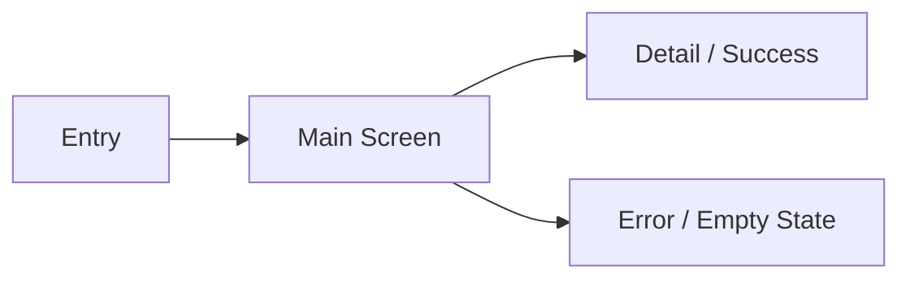

# Design Handoff Template

Use this template for screen, component, or flow handoffs in KMM and Compose projects.
Keep the doc short enough to scan, but complete enough that implementation does not have
to guess.

## Overview

- **Name:** `<screen or component name>`
- **Goal:** `<what the user is trying to accomplish>`
- **Audience:** `<who uses this>`
- **Primary path:** `<main happy path>`

## Wireframe

Provide one of the following:

### ASCII Sketch

```text
+--------------------------------------------------+
| <header / title>                                 |
|                                                  |
| <main content blocks>                            |
|                                                  |
| <primary action>                                 |
+--------------------------------------------------+
```

### Screen Flow Diagram



Use ASCII when the goal is to show structure quickly. Use a diagram when the goal is to
show navigation or branch points.

## Layout

- **Mobile:** `<single column / stacked / bottom sheet / etc.>`
- **Tablet:** `<two-pane / centered column / split layout / etc.>`
- **Desktop:** `<wider shell / side rail / persistent panel / etc.>`
- **Breakpoints:** `<what changes at each breakpoint>`

## Components

| Component | Variant | Notes |
|---|---|---|
| `<AppTopAppBar>` | `<standard / minimal / none>` | `<why it is used>` |
| `<AppButton>` | `<primary / secondary>` | `<placement and behavior>` |
| `<AppTextField>` | `<email / password / search>` | `<validation or helper text>` |

## States

| State | Behavior |
|---|---|
| `empty` | `<what the user sees>` |
| `loading` | `<skeleton / spinner / disabled controls>` |
| `error` | `<inline error / banner / retry>` |
| `success` | `<navigation / confirmation / next step>` |
| `disabled` | `<when and why>` |

## Motion and Feedback

- `<short note about transitions, loading, or feedback>`

## Accessibility

- `<focus order>`
- `<labels and content descriptions>`
- `<screen reader notes>`
- `<touch target notes>`

## Copy

| Element | Text |
|---|---|
| Title | `<copy>` |
| Supporting text | `<copy>` |
| Error text | `<copy>` |
| Empty text | `<copy>` |

## Preview Coverage

- `<mobile light>`
- `<mobile dark>`
- `<tablet light>`
- `<tablet dark>`
- `<desktop light>`
- `<desktop dark>`

## Open Questions

- `<anything unresolved, or "none">`

## Current Implementation Notes

- `<what the existing app already does, if this handoff is derived from a live app>`
- `<which parts are confirmed and which are inferred>`

